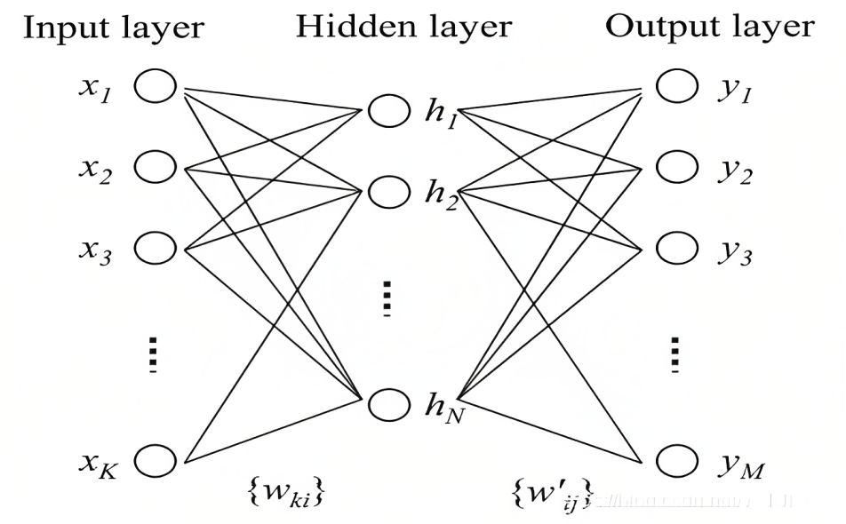
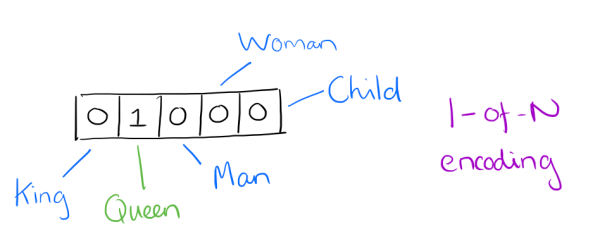
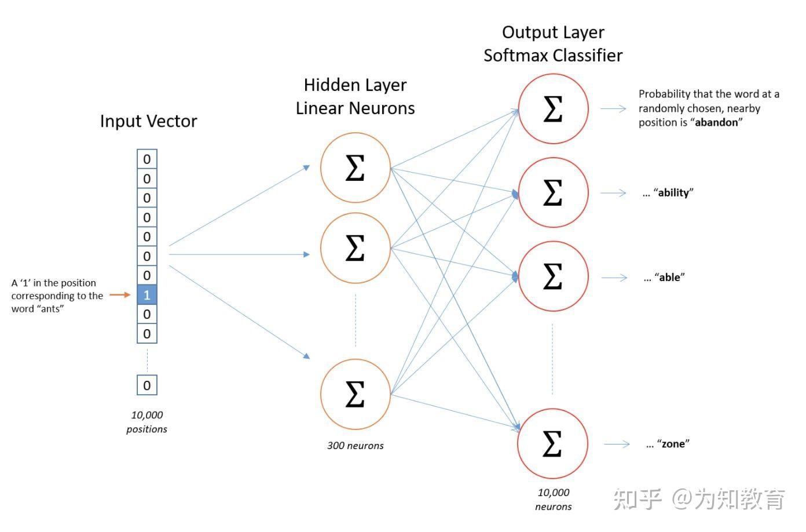

# 什么是Embedding

## N-Gram(N元语法)

- 基于一个假设：第n个词出现与前n-1个词相关，而与其他任何词不相关
- N=1时为unnigram，N=2时为bigram，N=3时为trigram

## 余弦相似度
- 通过测量两个向量的余弦值来度量它们之间的相似的
- 判断两个向量大致方向是否相同，方向相同时，余弦相似度为1；两个向量夹角为90时，余弦相似度的值为0；方向完全相反时，余弦相似度的值为-1。
- 两个向量之间夹角的余弦值为[-1, 1]

## 基于内容的推荐系统

- Step1：对酒店描述进行特征提取
- Step2：计算酒店之间的余弦相似度
- Step3：对于指定的酒店，选择余弦相似度最大的Top-K个酒店进行输出

# 神经网络与语言模型
## 神经网络
下图是一个简单的三层神经网络，$[x_1, x_2, ..., x_K]$是模型的输入，中间经过与权重矩阵$W_{ki}$运算，矩阵运算结果再经过非线性激活函数得到隐层的结果h，从隐层到输出层同理。

这样从输入层到输出层既有线性变换，又有非线性变换，因此可以更好刻画出输入变量的特征

## 语言模型分类
语言模型分为概率统计模型和神经语言模型

## 概率统计模型
统计语言模型就是用来计算句子概率的概率模型。计算句子概率的概率模型很多，n-gram模型便是其中的一种。

一般而言，语言模型都是为了使得条件概率$P(w_t|w_1, w_2, ..., w_{t-1})$最大化，不过考虑到近因因素，当前词只与距离它比较近的n个词更加相关(一般n不超过5)，而非前面所有的词都有关。因此上述公式可以近似为：
$P(w_t|w_1, w_2, ..., w_{t-1})$ = $P(w_t|w_{t-}, w_{t-2}, ..., w_{t-(n-1)})$
上述原理即为经典的N-gram模型。

词语是NLP中表义的基本单元，那么如何将词语进行表示。这里引入"词向量"技术，词向量是用来表示词的向量或特征，也可以被认为是词的特征向量。可以将不可计算的非结构化的词转化为可计算的结构化的向量，从而可以进一步应用于各项自然语言处理任务。

## 神经网络模型（https://blog.csdn.net/v_JULY_v/article/details/102708459）

# Word Embedding
## 什么是Embedding

- 一种降维方式，将不同特征转换为维度相同的向量
- 离线变量转换成one-hot => 维度非常高，可以将它转换为固定size的Embedding向量
- 任何事物，都可以转换成为向量的形式，从Trait #1到#N
- 向量之间，可以使用相似度进行计算
- 当我们选择时，可以选择相似度最大的

## Word2Vec
### 背景
Word2Vec是google在2013年推出的一个NLP工具，它的特点是能够将单词转化为向量来表示，这样词与词之间就可以定量的去度量他们之间的关系，挖掘词之间的联系。

#### One-Hot编码
最早词向量采用One-Hot编码，又称为一位有效编码，每个词向量维度大小为整个词表的大小，对于每个具体的词表中的词，将对应位置置为1。

采用One-Hot编码方式来表示词向量非常简单，但缺点也是显而易见的，一方面我们实际使用的词汇表很大，经常是百万级以上，这么高维的数据处理起来会消耗大量的计算资源与时间。另一方面，One-Hot编码中所有词向量之间彼此正交，没有体现词与词之间的相似关系。

#### Distributed representation编码
Distributed representation编码可以解决One-Hot存在的问题，它的思路是通过训练，将原来One-Hot编码的每个词都映射到一个较短的词向量上来，而这个较短的词向量的维度可以由我们自己在训练时根据任务需要来自己指定。有了用Distributed Representation表示的较短的词向量，我们就可以较容易的分析词之间的关系。

如何训练得到合适的词向量？Google提出了CBOW和Skip-gram两种神经网络模型。

### Word2Vec原理
Word2Vec的训练模型本质是只具有一个隐含层的神经网络，如下图：

他的输入时采用One-Hot编码的词汇表向量，它的输出也是One-Hot编码的词汇表向量。使用所有的样本，训练这个神经元网络，等到收敛之后，从输入层到隐含层的那些权重，便是每一个词的采用Distributed Representation的词向量。

### Word2Vec模式下的两个模型

#### CBOW(https://zhuanlan.zhihu.com/p/61635013)
CBOW适合于数据集较小的情况
#### SkipGram
Skip-Gram在大型语料中表现更好
### 原理
- 通过Embedding，把原先词所在空间映射到一个新的空间中去，使得语义上相似的单词在该空间内距离相近
- Word Embedding => 学习隐藏层的权重矩阵
- 输入测是one-shot编码
- 隐藏层的神经元数量为hidden_size(Embedding Size)
- 对于输入层和隐藏层之间的权重矩阵W，大小为[vocab_size， hidden_size]
- 输出层为[vocab_size]大小的向量，每一个值代表输出一个词的概率

# 课后补充
## 大模型分词器

## 

