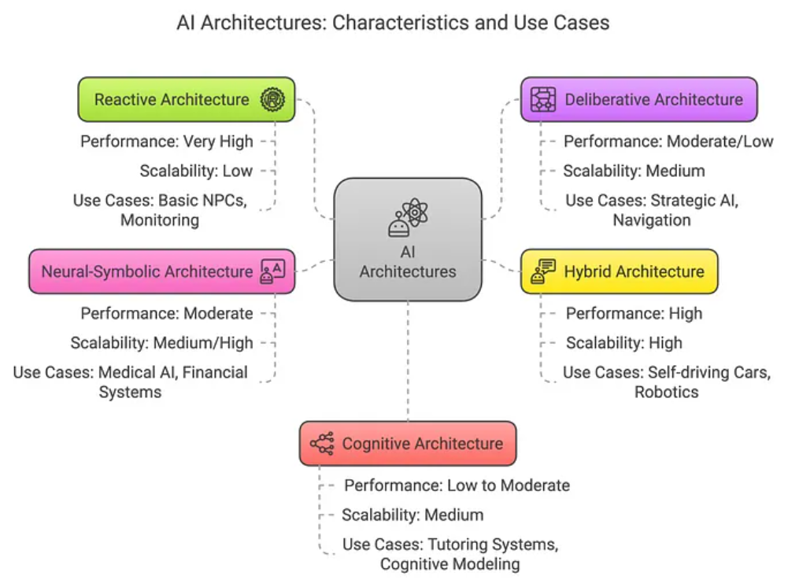
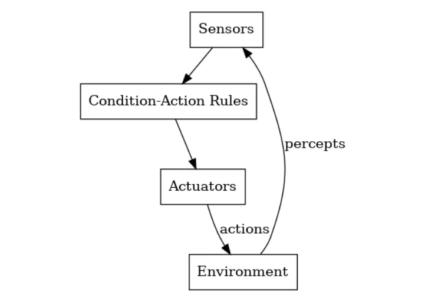
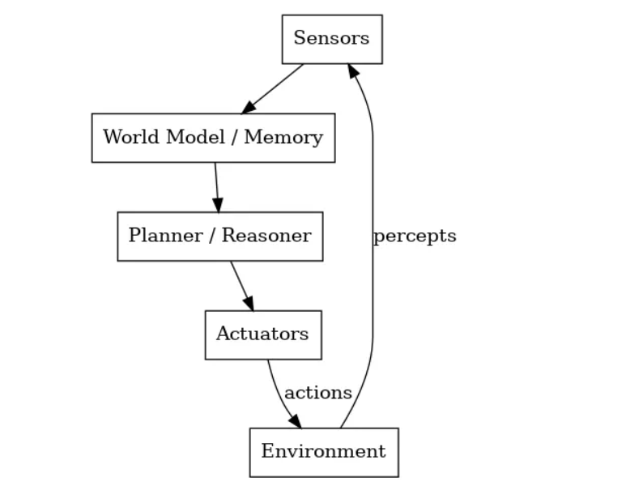
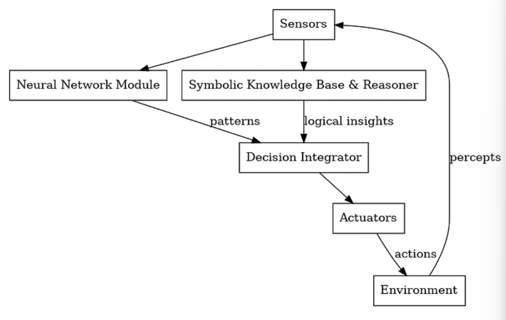
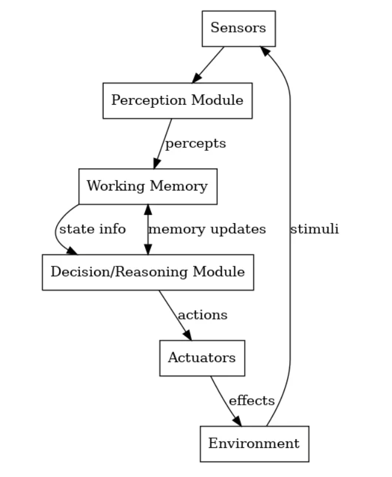

## 一、智能体架构

Agent架构 & 特征用例

## 二、智能体架构的分类
&ensp;&ensp;智能体架构大致可以分为：反应式架构、深思熟虑式架构、神经符号架构和认知架构。
### 2.1、反应式架构：快速决策的"直觉性"智能体
&ensp;&ensp;反应式架构是AI智能体设计中最简单的模式。在这种架构中，LLM首先分析当前情况，确定下一步采取的行动；然后，在环境中执行该动作，产生观察结果作为反馈；LLM处理这些观察结构，重新评估下一步行动，选择另一个行动，并继续这个循环，直到人物完成。

Agent反应式架构

- 优点
  - 适用于瞬间决策并且具有可预测、明确响应的领域
  - 没有全局规划能力，通常适用于简单或严格受限的任务，这些任务所有情况都可以预先定义规则
  - 没有复杂的推理开销，决策可以在恒定时间内完成
- 缺点
  - 由于它资深不学习不规划，因此在处理未遇见的情况时适应性较差
  - 决策短视，只优化即使响应，而不考虑长期后果

### 2.2、深思熟虑架构：深谋远虑"策略型"智能体
&ensp;&ensp;深思熟虑智能体是基于模型、以目标为导向的智能体，它会在行动之前进行推理。深思熟虑智能体会提前思考，使用内部模型评估多种可能的行动，并选择最佳计划来实现目标。

Agent深思熟虑架构

&ensp;&ensp;深思熟虑架构的智能体通常包括以下几个组件：
- 感知器：用于获取环境信息
- 建模：更新用于表示环境和智能体的状态
- 规划器：用于生成可能得计划并模拟/评估其结果
- 执行器：用于执行最佳计划或朝着目标迈出下一步

### 2.3、混合架构：速度和智慧的完美结合
&ensp;&ensp;混合架构是指将反应式架构和深思熟虑架构结合起来，以获得两者的优势，以在动态环境中实现速度和智能的平衡。

Agent 混合架构

混合架构的智能体通常按层次结构组织，底层是反应式（本能反应），中间层（可选）负责排序/协调，顶层是深思熟虑（目标推理和规划）。 通常包括以下几个组件：
- 感知器：用于获取环境信息
- 建模：更新用于表示环境和智能体的状态
- 规划器：用于生成可能得计划并模拟/评估其结果
- 执行器：用于执行最佳计划或朝着目标迈出下一步
- 反馈器：用于获取执行结果
- 学习器：用于更新模型和策略

### 2.4、神经符号架构：感知与推理的融合
&ensp;&ensp;神经符号架构是指将神经网络（用于从数据中学习）和符号AI（用于基于规则的知识处理和推理）结合起来，以实现感知和推理的融合，使智能体既能感知复杂环境，又能对其进行推理。

Agent 神经符号架构

神经符号架构的智能体通常包括以下几个组件：
- 感知器：用于获取环境信息
- 建模：更新用于表示环境和智能体的状态
- 推理器：用于进行符号推理
- 执行器：用于执行最佳计划或朝着目标迈出下一步
- 反馈器：用于获取执行结果
- 学习器：用于更新模型和策略

&ensp;&ensp;神经网络擅长模式识别(如图像、语音)，而符号系统则擅长推理和可解释性。这种架构的目的是利用神经感知和符号理解，做出智能且可解释的决策。

### 2.5、认知架构：模拟人类智能的"全能型"智能体
&ensp;&ensp;认知架构旨在模拟人类智能的综合性架构，通过将感知、记忆、推理和学习整合到一个统一的职能体系中，使智能体能够像人类一样学习、规划和解决问题和使用环境。

Agent 认知架构

## 参考
[AI智能体架构大揭秘](https://www.51cto.com/aigc/4987.html)
