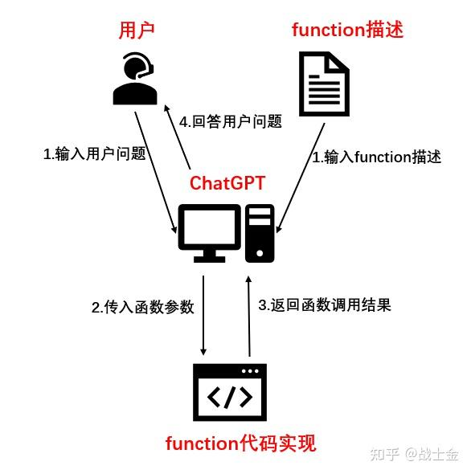

## FunctionCall作用
Function Call是一种让不仅大模型能够理解特定函数的能力，并可以格式化输出函数相关参数（函数名、参数及参数值），这对于构建更强大的Agent特别有用，因为它可以让模型不仅仅是生成文本，还可以执行实际的操作。可识别且格式化输出

## FunctionCall原理
OpenAI提供的Function Call功能，使用Function Call需要定义（并不是真的编写程序去定义一个函数，而仅仅是用文字描述一个函数）一些Function（需要指定函数名、函数的用途、参数名和参数描述），传给LLM。
当用户输入一个问题时，LLM通过分析是否需要一个Function，如果需要调用，那么LLM返回一个json，json包括需要调用的Function名、Function的参数名以及参数值。
总之，Function Call可以帮用户做两件事：
- 判断是否调用某个预定义的函数
- 如果要调用，从用户输入的文本中提取出函数所需要的参数值

<div align=center></div>

## FunctionCall描述
必须提供一个FunctionCall函数描述，这对llm非常重要，llm用函数描述来识别函数，是否适合回答用户的请求。

## FunctionCall样例
```python {.line-numbers}
functions = [
    {
        "name": "get_current_weather",
        "description": "Returns real-time weather information.",
        "parameters": {
            "type": "object",
            "preperties": {
                "location": {
                    "type": "string",
                    "description": "The location to get the weather for, e.g., '河北省承德市双桥区'"
                },
                "format": {
                    "type": "string",
                    "enum": ["celsius", "fahrenheit"],
                    "description": "Use your local temerature unit measurement",
                }
            },
            "required": ["location", "format"],
        }
    },
    {
        "name": "schedule_meeting",
        "description": "Schedules a meeting between two people.",
        "parameters": {
            "type": "object",
            "preperties": {
                "attendees": {
                    "type": "array",
                    "items": {"type": "string"},
                    "description": "List of attendees' email addresses or names."
                },
                "date_time": {
                    "type": "string",
                    "description": "Date and time of the meeting in ISO format, e.g., '2023-10-01T14:00Z'"
                },
                "duration_minutes": {
                    "type": "number",
                    "description": "Duration of the meeting in minutes"
                },
                "topic": {
                    "type": "string",
                    "description": "Topic of the meeting"
                }
            },
            "required": ["attendees", "date_time", "duration_minutes", "topic"]
        }
    }
]

initial_message = [
    {
        "role": "system",
        "content": "You are an AI Assistant designed to help users by calling functions based on their requests."
    },
    {
        "role": "user",
        "content": "What's the current weather in Beijing?"
    }
]

def llm_call(message):
    try:
        response = dashscope.Generation.call(
            model='qwen-turbo',
            messages=message,
            functions=functions,
            result_format='message'
        )

        return response.output.choices[0].message
    except Exception as ex:
        print(f"LLM call error: {str(ex)}")
        return{}
    
message = llm_call(initial_message)
print(message)
```